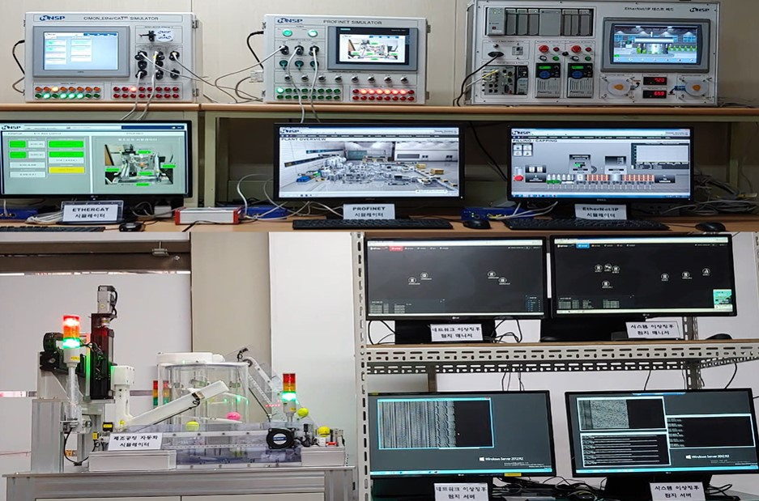
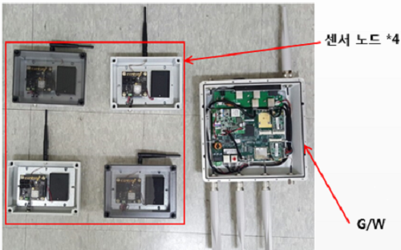
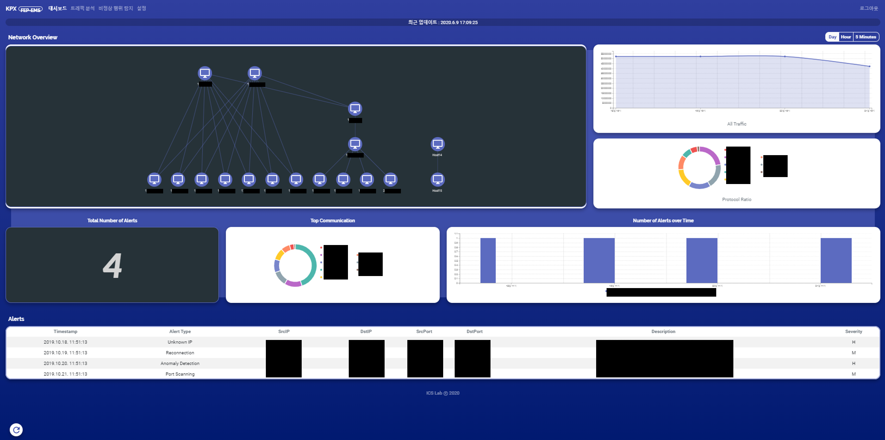
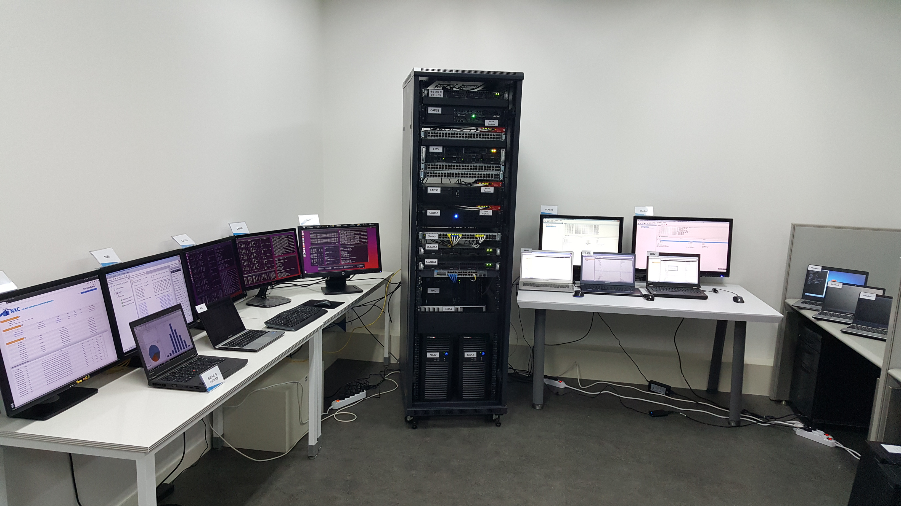
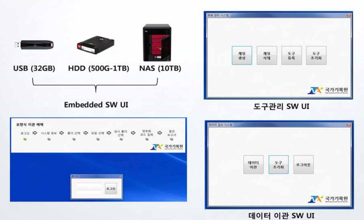

      <h3> Digital Forensics </h3>
  

   
  

    <ul>                
      <li>사물인터넷(IoT)기기 파일시스템 분석기법 연구 수행</li>
      <li>활용성 높은 IoT기기 파일시스템 4종 (JFFS2, UBIFS, cramfs, squashFS) 이상의 구조 분석</li> 
      <li>분석 대상 파일시스템 구조분석 및 도구 개발</li>               
      <li>분석 대상 파일시스템을 사용하는 IoT기기의 아티팩트 분석</li>
      <li>공동 연구 : 경찰청</li>
       
      

        

          
        

      

      

        주요 IoT 파일시스템 개요 및 구조도
      

     
      <li>메타버스 플랫폼 내 주요 데이터 접근 및 추출 방안 연구 수행</li>
      <li>HMD(Head Mounted Display) 하드웨어 대상 메타버스 플랫폼 데이터 획득 방안 도출</li>                
      <li>메타버스 플랫폼 내 주요 데이터 추출 및 분석 자동화 도구 개발</li>
       
      

        

          
        

      

      

        메타버스 에코시스템 개요도
      

     
      <li>이벤트 기반 실험시스템 구축을 통한 자동차 내·외부 아티팩트 수집 및 통합 분석 기술 개발</li>
      <li>V2N 동기화 데이터 및 IVI, EDR, DSSAD, 상용차 운행기록장치(DTG) 저장 데이터 수집·분석 기술 개발</li>
      <li>V2N(Vehicle to Nomadic Device) 시스템 생성 데이터 수집 기술 및 타임라인 기반 포렌식 아티팩트 분석기술 개발</li>
      <li>IVI, EDR, DSSAD, DTG 생성 빅데이터 수집 및 분석 기술 연구</li>
      <li>IVI 포렌식 도구 및 EDR/DSSAD/운행기록장치 데이터 분석 기술 개발</li>
      <li>공동 연구 : IITP</li>
       
      

        

          
        

      

      

        차량 대상 디지털 포렌식 개요도
      

     
      <li>스마트홈 시스템 모델링 및 획득 데이터 분류 연구</li>
      <li>스마트홈 구성 서비스 및 플랫폼 분류 도출</li>
      <li>스마트홈 공통 모델링 도출 및 모델링 기반 스마트홈 구성 도출</li>
      <li>스마트홈 내 획득 데이터 분류 수행</li>
      <li>공동 연구 : 대검찰청</li>
       
      

        

          
        

      

      

        스마트홈 공통 모델링
      

     
      <li>스마트홈 IoT(월패드 및 주변기기) 분석 기법 연구</li>
      <li>월패드 중심 스마트홈 에코시스템 데이터 획득 방안 도출(삼성, 코콤, 코맥스의 12종 스마트홈 기기 대상)</li>
      <li>스마트홈 에코시스템 포렌식 데이터 분석 및 아티팩트 도출</li>
      <li>공동 연구 : 경찰청</li>
       
      

        

          
        

      

      

        월패드 중심 스마트홈 에코시스템 포렌식 분석 테스트베드
      

     
      <li>웨어러블 장치 대상 디지털 포렌식 연구</li>
      <li>최신 스마트워치‧밴드 장치 내부 데이터 획득 방안 도출(삼성, 애플, 샤오미 등 7개 제조사의 17종 최신 기기 대상)</li>
      <li>스마트워치‧밴드 장치 내부 데이터 분석 및 사용자 아티팩트 도출</li>
      <li>공동 연구 : 경찰청</li>
       
      

        

          
        

      

      

        스마트워치 내부 접근을 위한 솔더링 수행 과정
      

     
      <li>차량 인포테인먼트 시스템 포렌식 및 아티팩트 도출 방안 연구</li>
      <li>차량 인포테인먼트 시스템 포렌식 중요 아티팩트 분석 결과 검증용 도구 개발</li>
      <li>공동 연구 : 한국정보보호학회(국가기관)</li>
       
      

        

          
        

      

      

        차량 인포테인먼트 시스템 포렌식 분석 테스트베드
      

     
      <li>차량 이더넷 환경의 딥러닝 기반 비정상행위 탐지 기술 개발</li>
      <li>차량 이더넷 기반 화이트리스트 자동 생성 및 필터링 기술 연구 수행</li>
      <li>도메인별 특징을 활용한 딥러닝 기반 비정상행위 탐지 기술 연구 수행</li>
      <li>공동 연구 : 현대엔지비</li>
       
      

        

          
        

      

      

        이더넷 기반 차량 네트워크 구성도
      
            
     
      <li>안드로이드 OS(9.10)에서 데이터 삭제 시 완전삭제 방안 연구</li>
      <li>안드로이드 기반 스마트폰 주요정보 삭제 시 복구 가능성 연구 수행</li>
      <li>안드로이드 기반 스마트폰 중요정보 완전삭제 방안 연구 수행</li>
      <li>공동 연구 : 국가보안기술연구소</li>
      

        

          
        

      

      

        안드로이드 기반 스마트폰 중요정보 완전삭제 방안
      
            
       
      <li>AI 스피커 포렌식 분석 연구</li>
      <li>인증서 인젝션 기반 AI 스피커 웹 프록시 설정 방안 연구</li>
      <li>웹프록시 기반 TLS 트래픽 아티팩트 수집 및 분석 방안 도출</li>
      <li>DFRWS USA 2020에 논문 채택(Certificate Injection-based Encrypted Traffic Forensics in AI Speaker Ecosystem)</li>
      <li>공동 연구 : 한국정보보호학회(국가기관)</li>
       
      

        

          
        

      

      

        취약점 기반 인증서 인젝션 및 웹프록시 구성
      

     
      <li>IITP 디지털 포렌식 통합 플랫폼 개발</li>
      <li>디지털 포렌식을 위한 데이터 규격 표준화 및 자율-확장형 통합 프레임워크</li>
      <li>Ext, XFS, HFS, YAFFS2 등의 다양한 파일 시스템 플랫폼의 복구 도구를 모듈화하여 하나의 프레임워크로 구축</li>
      <li>공동 연구 : IITP</li>
       
      

        

          
        

      

      

        디지털 포렌식 통합 플랫폼 구조도
      

     
      <li>AI Speaker 대상 디지털 포렌식 연구(NAVER, KAKAO, KT, SKT 4개 기종 AI Speaker 대상)</li>
      <li>네이버 Clova 클라우드에 저장된 명령어 히스토리 추출 도구 개발</li>
      <li>DFRWS USA 2019에 논문 채택(Digital Forensic Practices and Methodologies for AI Speaker Ecosystems)</li>
      <li>공동 연구 : 대검찰청</li>
       
      

        
      

      

        인공지능 스피커 TLS 트래픽 분석 테스트베드
      

     
      <li>Linux File System 삭제된 파일 복원 도구 개발(Ext2/3/4 지원)</li>
      <li>XFS File System 삭제된 파일 복원 도구 개발</li>
      <li>UFS1,2 File System 삭제된 파일 복원 도구 개발</li>
      <li>공동 연구 : 대검찰청, 한국연구재단</li>
      

        
      

      

        대검찰청 맞춤형 CLI환경기반 통합(EXT 2/3/4 Filesystem) 복구 도구
      

    </ul>
  

  <h3>Industrial Control System/Smart Manufacturing Security</h3>

 

  <ul>
    <li>이더넷 기반 통신 정량적 진단 방안 및 툴 개발</li>
    <li>이더넷 기반 통신 패킷 분석 및 이상 진단 기술 연구</li>
    <li>이더넷 기반 통신 진단과 시각화를 위한 H/KMC 표준안 연구</li>
    <li>현재 이더넷 기반 시스템의 통신품질 개선 및 예방보전을 위한 전용 진단 툴 개발중</li>
    <li>공동 연구 : 현대엔지비</li>
    

        
      

      

        이더넷 기반 산업용 네트워크 구성도
      

  </ul>

 

  <ul>
    <li>IITP 스마트공장</li>
    <li>스마트공장 이상징후 탐지 엔진 개발</li>
    <li>제어시스템 및 산업용이더넷을 대상으로 딥러닝 기반 탐지 엔진 개발 수행</li>
    <li>공동 연구 : IITP, NNSP, NSHC</li>
    

      
      
<스마트공장 이상징후 탐지 엔진 테스트베드>

    

  </ul>

 

    <ul>
        <li>ISA 100.11a 기반 전력제어시스템 무선 보안 기술 개발</li>
        <li>ISA 100.11a 보안 기능 분석</li>
        <li>ISA 100.11a 테스트베드 구축 및 보안 기능 개발 수행</li>
        <li>공동 연구 : 한국전력</li>
        

            
            
< ISA 100.11a 기반 전력제어시스템 테스트베드>

        

    </ul>

 
 

    <ul>
        <li>전력 기반시설 비정상행위 탐지알고리즘 고도화 및 탐지장비 개발 연구</li>
        <li>EMS 연계구간 비정상행위 탐지 학습 시스템의 고도화를 위한 기반 구축 연구 수행</li>
        <li>지능형 학습 기반 알고리즘 적용을 통한 Baseline 알고리즘의 고도화 연구 수행</li>
        <li>EMS 연계구간 별 지능형 학습기반 탐지 도구 개발</li>
        <li>공동 연구 : 전력거래소</li>
        

            
            
< EMS 연계구간 별 지능형 학습기반 탐지 도구 대쉬보드>

        

    </ul>

 
 

    <ul>
        <li>IEC 61850 전력제어시스템의 APT 사이버공격 대응 기술 개발</li>
        <li>IEC 61850 기반 사이버 공격 대응 통합 관리 및 인증 시제품 개발 수행</li>
        <li>IEC 61850 환경의 계층별 사이버 공격탐지 시제품 개발 수행</li>
        <li>공동 연구 : 한국에너지기술평가원</li>
        

            
            
<전력 제어시스템 테스트베드>

        

    </ul>

    <h3> Electronic Record Management </h3>

 

    <ul>
        <li>국가기록원 오프라인 이관 도구 개발</li>
        <li>디지털 포렌식 기반의 전자기록물 이관 기술 접목</li>
        <li>현재 국가기록원 전자기록 오프라인 시험이관에 적용 중</li>
        <li>공동 연구 : 국가기록원</li>
        

            
            
<전자기록물 오프라인 이관 도구(국가기록원 실 사용중)>

        

    </ul>

    <h3> Current Research Projects </h3>

 

    <ul>
        <!-- 190724 syh Update -->
        <li>Digital Forensic Analysis on AI Speaker, NIS, 03.2019 ~ 11.2019</li>
        <li>A Study on advanced anomaly detection algorithm and implement an intrusion detection system for the electric power grid, 07.2018 ~ 06.2020</li>
        <li>Developement of Digital Forensic Integration Platform, IITP, 05.2018 ~ 01.2021</li>
        <li>Advanced Manufacturing Process Anomaly Detection to prevent the Smart Factory Operation Failure by Cyber Attacks, IITP, 04.2018 ~ 12.2020</li>
    </ul>

    <h3> Previous Research Projects </h3>

 

    <ul>
        <!-- 161114 wyjo Update -->
        <li>Research on Network Forensic Architecture for Industrial Control System, National Security Research Institute, 04.2016 ~ 10.2016 </li>
        <li>
            Development on File System Forensic Tool, National Research Foundation of Korea,
            10.2012 ~ 09.2016
        </li>
        <li>
            Research on Development of Platform, Contents, and Service Security Technologies
            in Android-based Open Mobile Environment, National Research Foundation of Korea,
            5.2012 ~ 04.2015
        </li>
        <li>
            Research on Zombie Client Protection in Mobile Open Platform, Korea Sanhak Foundation,
            06.2012 ~ 05.2013
        </li>
        <li>
            Research on the Advanced Electronic Record Management based on Digital Forensics,
            National Archives of Korea, 04.2012 ~ 11.2012
        </li>
        <li>Research on Intrusion Detection for Smartgrid, KEPCO, 09.2012 ~ 03.2013</li>
        <!-- 161114 wyjo Update Before -->
        <li>
            Research on the Classification and Analysis of Public DataBase in Digital Forensics,
            Prosecution Service, 10.2012 ~ 12.2012
        </li>
        <li>
            Research on the Classification and Analysis of Whiltelist-based Power Control System
            Security, National Security Research Institute, 10.2012 ~ 04.2013
        </li>
        <li>
            Research on the Analysis of IEC 62351 standard, LS Industrial Systems, 08.2012 ~
            11.2012
        </li>
        <li>
            Research on a Survey and Detection for Data Leakage based on Abnormal Network Connection,
            National Security Research Institute, 03.2012 ~ 10.2012
        </li>
        <li>
            Research on Secure Charging Protocol for EV-to-EVSE, Hyundai Motor, 10.2011 ~ 03.
            2012
        </li>
        <li>
            Research on Digital Forensic for Grid Embedded Device, National Security Research
            Institute, 10.2011 ~ 03.2012
        </li>
        <li>
            Research on System Memory Protection and Appstore Authentication for Smart Device
            Platform, Korea Sanhak Foundation, 06.2011 ~ 05.2012
        </li>
        <li>
            Research on Security Technologies for Microgrid and GEV(Grid Enabled Vehicle) in
            Smartgrid 2.0, KIER, 10.2011 ~ 12.2011
        </li>
        <li>
            Research on Network Interworking, Authentication and Encryption for Wireless Mesh
            Network, ETRI, 06.2011 ~ 12.2011
        </li>
        <li>
            Research on DNS Query-based Cyber Attack Prelude Detection Platform Development,
            ETRI, 07.2011 ~ 01.2012
        </li>
        <li>
            Research on Analysis and Response of Memory Dump Attacks, National Security Research
            Institute, 04.2011 ~ 10.2011
        </li>
        <li>Field Key Provisionin for Smart Tablet Device, In Samsung, 2010.12 ~ 2011.02</li>
        <li>
            Smart Connectivity and Sharing Device Solution Technology Development, In Samsung,
            2009.11 ~ 2010.12
        </li>
        <li>
            Wireless Mesh/Relay Technology Development for U-computing, In Samsung, 2009.02
            ~ 2009.10
        </li>
        <li>
            Distributed Authentication Technology Development for USN environment, with KAIST,
            2008.01 ~ 2008.12
        </li>
        <li>
            Interlocking Framework Development between WPAN and NEMO(Network Mobility), In Samsung,
            2007.01 ~ 2007.12
        </li>
        <li>
            Wibro micro RAS(Radio Access Station)/ACR(Access Control Router) Development, In
            Samsung, 2006.01 ~ 2006.12
        </li>
        <li>
            Wibro PCMCIA Model Device Driver Development, In Samsung, 2005.08 ~ 2005.12
        </li>
        <li>
            A Study on the Analysis of Internet Worm Propagation and Modeling , National Security
            Research Institute, 2005.04~2005.10
        </li>
        <li>
            Development of Security Patch Management Framework in Multi-Platform Environment,
            National Security Research Institute, 2003.05~2004.10
        </li>
        <li>
            Application Research of Machine Learning and Computer Forensics, ITRC, Ministry
            of Information and Communication, 2003.08~2004.07
        </li>
        <li>
            Development of Security Patch Management Framework in Multi-Platform Environment,
            National Security Research Institute, 2003.05~2003.10
        </li>
        <li>
            A Study on the Defense and Evasion of Information Security Solutions, Korea Information
            Security Agency, 2002.05~2002.11
        </li>
        <li>
            A Study on the Automatic Distribution Method of Security Patch, National Security
            Research Institute, 2002.05~2002.10
        </li>
        <li>
            Development of Broker and Agent based Integrated Single Sign On System, PrimeSecure,
            2000.12 - 2001.05
        </li>
        <li>
            A Study on the Security Threat Element Analysis and Security Architecture in Military
            Satellite Communication Environment, Agency for Defense Development, 1999.12 - 2001.06
        </li>
        <li>
            SMIB-based Object-Oriented Operation and Management Systems for Integrated Information
            Security Engine, Ministry of Science and Technology, 1998. 12 - 2000. 10
        </li>
    </ul>

  